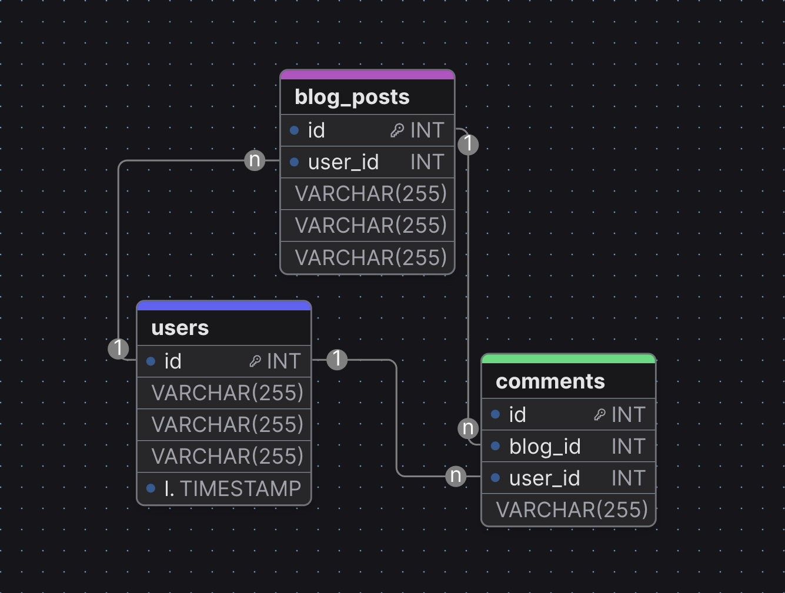
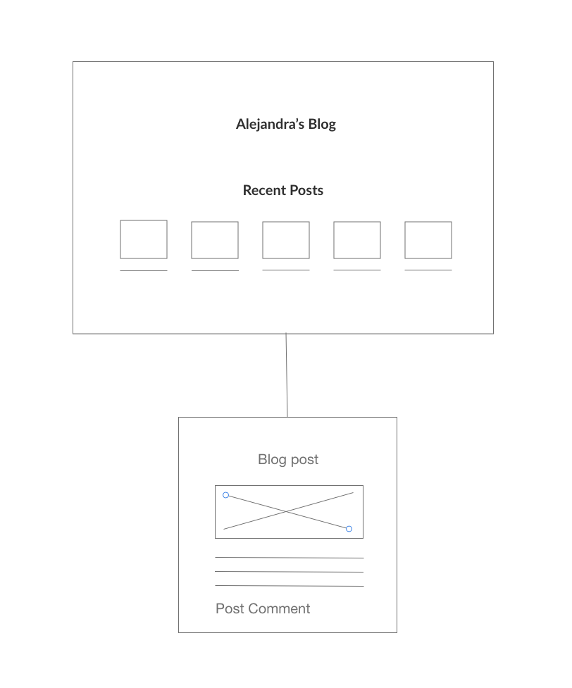

# Alejandra's Blog

This is a blog by Alejandra Valdivia about her interests such as software engineering, WordPress development, PHP, SEO, Web Design, hiking, camping, and more. [Alejandra's Blog](https://accelerate.hyperlinkweb.dev/blog/).

## Technologies used

- Backend: Django, Python, and PostgreSQL
- Frontend: HTML, CSS, JavaScript

## Features

- Create, edit, and delete posts
- Create, edit, and delete comments
- Filter posts by date, and category

## Getting Started

1. Clone the repository from [GitHub](https://github.com/AlejandraValdivia).

   ```bash
   git clone https://github.com/AlejandraValdivia/alejandras-blog
   ```

2. Install the dependencies.
   pip install -r requirements.txt

3. Run the server.

   ```
   python manage.py runserver
   ```

4. Open [http://localhost:8000](http://localhost:8000) in your browser.

## Contributing

Make a pull request with the changes you want to make.

## ERD



### Authors

- user_id

### Posts

- user_id
- title
- body

### Comments

- user_id
- post_id
- body

## Wireframes



Author: [Alejandra Valdivia](https://github.com/AlejandraValdivia)
